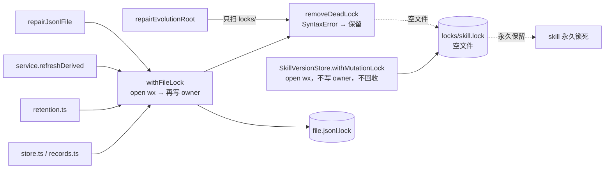
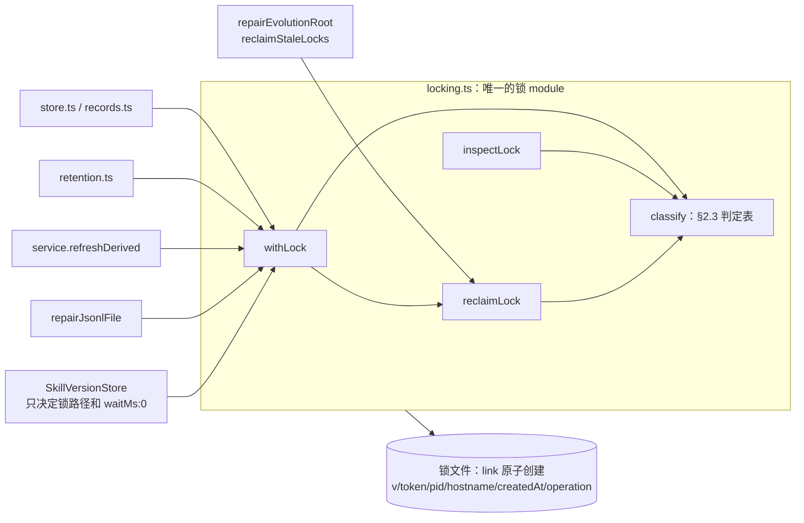

# 统一锁协议：锁文件写 owner，repair 回收崩溃遗留锁

- Issue：SKIL-41（父 SKIL-35，来源 SKIL-34 扫描第 1 条）
- 基线：`origin/main` @ `c168579`
- 范围：`packages/skill-evolution`。不改 `dsh-adapter`、`dsh-bundle`。

## 1. 现状

### 1.1 读了什么

- `packages/skill-evolution/src/locking.ts`（全文）：`withFileLock`、`removeDeadLock`、`hasCode`
- `packages/skill-evolution/src/lifecycle.ts`（全文）：`SkillVersionStore.withMutationLock`（`:215-235`）、`recoverPublication`、`.publish.json` 日志
- `packages/skill-evolution/src/repair.ts`（全文）：`repairJsonlFile`、`repairEvolutionRoot`、`removeOrphanLocks`（`:109-121`）
- 调用方：`src/store.ts:26,45`、`src/records.ts:14,31,44`、`src/retention.ts:13`、`src/service.ts:138-152,413-437`
- `src/index.ts`（`locking.ts` 不在公开导出里）、`package.json`（`exports` 含 `./src/*`，`engines.node >=22`）
- 测试：`tests/core.spec.ts:131-138`（死 owner 的 JSONL 锁）、`tests/evolution.spec.ts:209-219`（发布锁写字面量 `'held'`）
- `packages/skill-evolution/README.md:58-60,73-76`（锁的对外承诺：仅本机本地文件系统，repair 只删本机死 owner 的锁）
- `AGENTS.md`（红线：core 包不依赖 DSH 内部）、SKIL-34 报告附件第 1 条

### 1.2 两套锁

| | `withFileLock`（`locking.ts:7`） | `withMutationLock`（`lifecycle.ts:215`） |
|---|---|---|
| 锁文件 | `<资源文件>.lock`，与资源同目录 | `.skill-evolution/locks/<skill>.lock` |
| 用在 | 9 个 JSONL store、`rotateJsonl`、`repairJsonlFile`、`refreshDerived`（cursor） | `readCurrent`、`promote`、`rollback` |
| 写 owner | 先 `open('wx')`，再 `writeFile({pid,hostname,createdAt})`，两步之间有窗口 | 不写，锁文件永远是空的 |
| 争用 | 轮询 20ms，最多等 5s；等待时顺手 `removeDeadLock` | 立即失败 `already in progress` |
| 进程内串行 | 各 store 自带 `writeQueue`（读路径不排队） | 自带 `mutationQueue` |
| 崩溃恢复 | 死 pid 能回收；空文件/损坏文件 `SyntaxError` → 永不回收 | 从不回收；只有 repair 扫 `locks/`，但同样卡在 `SyntaxError` |

`repairEvolutionRoot` 只扫 `locks/` 目录，不看任何 `*.jsonl.lock` 和 `projection-cursor.json.lock`。

### 1.3 复现（`c168579`，build 之后用一次性脚本跑，脚本已删除）

```text
A empty publish lock -> removed 0 preserved 1
A promote after repair -> Skill publication already in progress for "api-debugging"
B promote with dead-owner lock, no repair -> Skill publication already in progress for "api-debugging"
C repairJsonlFile with empty lock -> store busy: /tmp/.../events.jsonl.lock (5011ms)
C locks/ dir entries 0
```

- A：promote 中途崩溃留下空发布锁，repair 之后仍然锁死。这就是 issue 里说的永久锁。
- B：即使锁里写着死 owner，发布路径自己也不会回收，只能靠 repair。
- C：`withFileLock` 死在 `open` 和 `writeFile` 之间留下的空锁，`repairJsonlFile` 自己就会卡 5 秒后失败；`repairEvolutionRoot` 根本扫不到它。

另有两个读代码发现、没有单独复现的问题：

- **回收竞态**：`removeDeadLock` 先读、判死、再 `unlink`。两个进程同时判死时，后 `unlink` 的那个可能删掉先回收者刚建好的新锁。
- **释放不校验身份**：`finally { unlink(path) }` 不确认锁还是自己的。锁若已被别人回收重建，释放会删掉别人的锁。
- **重启后 pid 复用**：机器崩溃重启后，锁里的旧 pid 可能被系统新进程占用，`kill(pid,0)` 判活，锁永不回收。

## 2. 设计问题与选项

### 2.1 锁 module 的 interface 形状

**选项 A：作用域式，三个函数（推荐）**

```ts
withLock<T>(path, operation, fn, options?): Promise<T>   // 获取 + 释放
inspectLock(path, options?): Promise<LockState>         // 查询
reclaimLock(path, options?): Promise<ReclaimResult>     // 按统一规则回收
```

**选项 B：句柄式**

```ts
acquireLock(path, operation, options?): Promise<LockHandle>  // handle.release()
inspectLock / reclaimLock 同 A
```

**选项 C：绑定根目录的 `LockManager` 类，按 key 加锁**，所有锁文件集中到 `.skill-evolution/locks/<key>.lock`。

| | A 作用域 | B 句柄 | C LockManager |
|---|---|---|---|
| 复杂度 | 最低；释放不可能被忘 | 调用方要自己 `try/finally` | 多一层对象和 key 命名规则 |
| 可测性 | 好；崩溃场景靠直接写锁文件 + 注入环境来造 | 同 A，还能测“持锁中途”的状态 | 同 A |
| 可逆性 | 以后要句柄式，可以在内部加 `acquireLock` 再让 `withLock` 包它 | 回退到 A 要改所有调用点 | 锁文件位置变了，回退要再搬一次 |
| 迁移成本 | 现有调用方都是作用域式（`withFileLock(path, fn)`），机械替换 | 每个调用点改写成 `try/finally` | 改路径；新旧版本进程共存时两边锁不同的文件，互斥失效；还会抢先定下 SKIL-38 的目录布局 |

推荐 **A**。`withFileLock` 的 8 个调用点和 `withMutationLock` 的 3 个入口全是作用域用法，没有需要跨函数持锁的场景；B 的额外能力今天没人用。C 的集中目录与 SKIL-38（演化状态根目录）重叠，本设计**不改任何锁文件的位置**，只统一协议。

### 2.2 锁文件格式与写入原子性

格式在各选项里相同，是现有 `{pid, hostname, createdAt}` 的超集。旧版本的 `removeDeadLock` 读新文件仍然能拿到 `pid` 和 `hostname`：

```json
{"v":1,"token":"<randomUUID>","pid":4242,"hostname":"build-7","bootTime":"2026-09-26T08:00:00.000Z","createdAt":"2026-09-26T13:00:00.000Z","operation":"promote"}
```

- `v`：格式版本。没有 `v` 但有 `pid`/`hostname` 的旧文件按 v0 解析，规则相同，只是没有 `token` 和 `bootTime`。
- `token`：`crypto.randomUUID()`。释放时核对，防止删掉别人的锁。
- `bootTime`：`Date.now() - os.uptime() * 1000`，ISO 字符串，用来识别“机器重启后 pid 被复用”。
- `operation`：调用方传入的短字符串（`append`、`read`、`replace`、`repair`、`rotate`、`refresh`、`promote`、`rollback`、`read-current`），只用于诊断和 repair 报告，不参与判定。

**写入选项 A：临时文件 + `link()`（推荐）**。先把 owner 写进同目录的 `<lock>.<token>.tmp`，再 `link(tmp, lockPath)`；目标已存在时 `link` 以 `EEXIST` 失败，所以锁一出现就带着完整内容。最后 `unlink(tmp)`。

**写入选项 B：保留 `open('wx')` 再写**，把“空文件”当成“正在写入”，给一个宽限期。

**写入选项 C：`mkdir(lockDir)` + 目录里放 `owner.json`**。目录创建是原子的，但 owner 仍是第二步写，窗口和 B 一样。

| | A link | B open+write | C mkdir |
|---|---|---|---|
| 复杂度 | 多一个临时文件和一次清理 | 最低 | 要处理目录和文件两种残留 |
| 可测性 | “锁存在但无 owner”只可能来自旧版本或掉电，测试直接写空文件就能覆盖 | 必须测时间窗口 | 同 B |
| 可逆性 | 锁路径和内容不变，随时可以换回 B | — | 锁从文件变成目录，旧版本进程 `open('wx')` 会拿到 `EISDIR`，不可平滑回退 |
| 迁移成本 | 与旧版本同路径互斥（`link` 和 `open('wx')` 都靠 `EEXIST`） | 同 A | 与旧版本不兼容 |

推荐 **A**。不做 `fsync`：掉电后 lock 可能是零长度，这由 §2.3 的 `unknown` 规则兜底。临时文件残留（进程死在写 tmp 和 `link` 之间）由 repair 清理。`link` 在不支持硬链接的文件系统上会报错，这时直接抛出，不静默退回 B；README 已声明只支持本机本地文件系统。

### 2.3 「崩溃遗留锁」判定规则

一个锁文件只会被归为下面一种状态。判定只看锁文件内容、文件 mtime 和本机当前状态，**不依赖时钟之外的任何配置**。

| 状态 | 条件（按顺序匹配） | 回收？ |
|---|---|---|
| `free` | 文件不存在 | — |
| `unknown` | 空文件、JSON 解析失败、缺 `pid`/`hostname`/`createdAt`，或 `pid` 不是正整数 | 文件 mtime 距今超过 `unknownGraceMs` 时回收，否则保留 |
| `foreign` | `hostname` 不等于本机 | 保留，报告 |
| `rebooted` | 本机，`createdAt` 早于本机本次启动时刻（`Date.now() - os.uptime()*1000`）减 60s 容差 | 回收：owner 属于上一次启动，不可能还活着 |
| `dead` | 本机，`process.kill(pid, 0)` 抛 `ESRCH` | 回收 |
| `held` | 本机，`kill(pid,0)` 成功或抛 `EPERM`（进程存在但属于别的用户） | 保留，不论持有多久 |

几点说明：

- `rebooted` 用的是锁里已有的 `createdAt`，旧格式（v0）也适用，不需要新增 `bootTime` 字段。它解决 §1.3 末尾的 pid 复用问题。
- `unknown` 的宽限期是为了保护**混用版本**时旧进程的空锁（旧 `open('wx')` 写 owner 前的窗口，以及旧版发布锁整个持有期都是空文件）。新版本自己只可能因为掉电留下空锁。
- 「超时」只作用于 `unknown`。能证明 owner 还活着的 `held` 锁，持有再久也不回收，repair 只在报告里标出持有时长。这是对 issue 原文「超时能回收」的收窄，理由是它和「活着的 owner 不被误回收」冲突；见 §5 待定项 D3。
- `EPERM` 今天被当成“无法判断、保留”，新规则把它明确归为 `held`，行为不变。

**谁来回收**：同一条规则有两个入口，结果一致。

1. `withLock` 争用时：`EEXIST` → `inspectLock` → 可回收则 `reclaimLock` 后立刻重试，否则等到 `waitMs` 截止。发布锁因此也能自愈（修掉 §1.3 的 B）。
2. `repair`：显式对所有已知锁调用 `reclaimLock`，并写进报告（修掉 A 和 C）。

**回收本身的并发安全**（修掉回收竞态）：

- **选项 A：回收守卫（推荐）**。回收 `X` 前先用同一套 link 协议拿 `X.reclaim`（`waitMs` 0，拿不到就当作别人正在回收，直接去重试获取 `X`）。拿到后重新读 `X`、重新判定、`unlink`、释放守卫。能改动 `X` 的只有它的 owner（已判死，不会动）和回收者（已被守卫串行化），所以“读—判—删”之间 `X` 不会被换掉。守卫自身若遗留，按同一张表判定（守卫一定带 owner），直接 `unlink`，不再套守卫。
- **选项 B：rename 到墓碑再比对**。`rename(X, X.reclaimed-<token>)` 后读墓碑，内容与判定时不一致就说明抢到了活锁，再 `link` 回去。恢复这一步本身会竞争失败，失败时活 owner 的锁文件就丢了。
- **选项 C：不处理**，接受极小概率的误删。

推荐 **A**：正确性论证最短，只多一个短命文件。剩余风险只在“两个回收者同时回收一个已死的守卫”，这时最坏结果是两者都进入对 `X` 的回收，而 `X` 已被判死，结果仍然正确。

**释放**：读锁文件，`token` 与自己的一致才 `unlink`；不一致或文件已不存在就只记一次警告，不抛错（修掉“释放不校验身份”）。

### 2.4 进程内串行放在哪

各 store 的 `writeQueue` 和 `SkillVersionStore.mutationQueue` 保证同一实例内的顺序。可以把它们收进锁 module（按路径的进程内队列），也可以留在调用方。

推荐**留在调用方，本次不动**。收进来会改变语义：同进程里两个 `SkillVersionStore` 实例现在是互相 fail-fast，收进来后会变成排队；`readAll` 现在不排队，收进来后会排队。这些行为变化和本 issue 无关，可以以后单独做。

### 2.5 unknown 锁的判定补充

`unknown` 锁没有 `createdAt`，改用文件 mtime：mtime 早于本机本次启动时刻（减 60s 容差）时按 `rebooted` 立即回收，覆盖“掉电留下零长度锁”；否则等 `unknownGraceMs`。这样新版本自己产生的空锁（只可能来自掉电）重启后立刻可回收，宽限期只影响旧版本进程留下的空锁。

## 3. 推荐方案

### 3.1 Interface

`src/locking.ts` 整体替换为下面这个 module。

```ts
export type LockState =
  | { readonly kind: 'free' }
  | { readonly kind: 'held'; readonly owner: LockOwner; readonly ageMs: number }
  | { readonly kind: 'foreign'; readonly owner: LockOwner; readonly ageMs: number }
  | { readonly kind: 'dead' | 'rebooted'; readonly owner: LockOwner; readonly ageMs: number }
  | { readonly kind: 'unknown'; readonly ageMs: number; readonly reclaimable: boolean }

export interface LockOwner {
  readonly v?: 1
  readonly token?: string
  readonly pid: number
  readonly hostname: string
  readonly createdAt: string
  readonly operation?: string
}

export interface LockOptions {
  readonly waitMs?: number          // 默认 5000；0 表示只试一次（含一次回收）
  readonly unknownGraceMs?: number  // 默认 600_000
}

export class LockBusyError extends Error {
  readonly path: string
  readonly state: LockState         // 截止时最后一次 inspect 的结果
}

/** 获取 → 执行 → 释放。争用时按 §2.3 自动回收可回收的锁。 */
export function withLock<T>(path: string, operation: string, fn: () => Promise<T>, options?: LockOptions): Promise<T>

/** 只读判定，不改任何文件。 */
export function inspectLock(path: string, options?: Pick<LockOptions, 'unknownGraceMs'>): Promise<LockState>

/** 可回收则在回收守卫下删除；返回删除前的判定和是否删除。 */
export function reclaimLock(path: string, options?: Pick<LockOptions, 'unknownGraceMs'>): Promise<{ readonly state: LockState; readonly removed: boolean }>

export function hasCode(error: unknown, code: string): boolean   // 保留，repair/lifecycle 复用
```

interface 里调用方要知道的事实：

- 锁只在同一主机、本地文件系统上有效；`link` 不可用时抛原始错误。
- `withLock` 不可重入：同一进程对同一路径嵌套调用会等到超时。进程内顺序由调用方自己的队列保证（§2.4）。
- 回收规则只有 §2.3 这一张表；`withLock` 和 repair 走的是同一份实现。
- `LockBusyError.state` 让调用方决定错误文案，例如 `SkillVersionStore` 仍然抛 `Skill publication already in progress for "<skill>"`，并在消息后附上 owner 的 pid 和 operation。

`withFileLock` 和 `removeDeadLock` 删除。它们没从 `src/index.ts` 导出，仓库里也没有包外调用方（`grep -rn "locking" packages --include=*.ts --include=*.js --include=*.mjs` 只命中 `skill-evolution/src` 内部），但 `package.json` 的 `exports` 暴露了 `./src/*`，严格说是可见的，见 §5 D2。

内部实现拆成几个私有函数（`writeOwner`、`classify`、`underReclaimGuard`、`release`），都是 module 内部的 seam，不导出。测试不需要注入时钟或进程探测：所有状态都能靠真实文件和真实 pid 构造（见 §6）。

### 3.2 发布锁的语义

`withMutationLock` 改为调用 `withLock(lockPath, operation, fn, { waitMs: 0 })`：

- 锁文件位置不变：`.skill-evolution/locks/<skill>.lock`。
- 仍是 fail-fast，但失败前会按规则回收一次。死 owner、上次启动的 owner、宽限期外的空锁都会被自动回收，不用再跑 repair。
- `operation` 分别是 `read-current`、`promote`、`rollback`。
- 回收发布锁后，下一次 `readCurrentUnlocked` 里现有的 `recoverPublication` 会按 `.publish.json` 把中断的发布补完，这条路径不用改。

### 3.3 repair 覆盖的锁

`repairEvolutionRoot` 的锁清理改名为 `reclaimStaleLocks`，扫描三类位置，对每个锁文件调用 `reclaimLock`：

1. `.skill-evolution/locks/*.lock`（发布锁）
2. `.skill-evolution/*.lock`（状态目录下 9 个 JSONL 和 cursor 的锁）
3. `options.observationsPath` 与 `options.jsonlPaths` 各自的 `<path>.lock`（observation store 可以在状态目录之外，例如 bundle 的 `~/.dsh/skill-evolution/events.jsonl`）

同时清理这些目录里的协议残留：`*.lock.*.tmp`（写 owner 时崩溃）和 `*.lock.reclaim`（回收时崩溃，按同一张表判定）。

`EvolutionRepairReport` 只做加法，`orphanLocksRemoved`、`locksPreserved` 保持原样：

```ts
readonly locks: readonly { readonly path: string; readonly state: LockState['kind']; readonly operation?: string; readonly ageMs: number; readonly removed: boolean }[]
```

`service.repair()` 里 `repairJsonlFile` 在前、`repairEvolutionRoot` 在后，顺序不变。`repairJsonlFile` 通过 `withLock` 自己就能回收它要用的那一把锁，所以 §1.3 的 C 不再卡 5 秒。

### 3.4 Before / After 模块关系

Before：



After：



**locality**：判定表只有一份，`withLock` 自愈和 repair 回收走同一个 `classify`。**leverage**：全部 11 个加锁入口只学一个函数，就同时得到 owner 记录、原子写、自动回收和释放校验。**删除测试**：删掉这个 module，owner 写入、判活、回收会重新散回至少 3 个文件，这正是今天的状态。

### 3.5 这条 seam 将来会被什么拉扯

- **锁文件位置**：SKIL-38 会重新定目录布局。锁路径由调用方传入，布局变化只改调用方，不碰锁 module。
- **跨主机/网络文件系统**：若要支持，得换一种判活方式（租约 + 心跳）。那时才会有第二个 adapter；今天只有一个，**不引入可替换的判活 seam**，`classify` 保持为内部函数。
- **更多加锁操作**（worker 与 CLI 并发 promote、按 scope 加锁）：只需传一个新的 `operation` 字符串，不用选协议。
- **诊断需求**（`health` 里展示锁状态）：`inspectLock` 已经是只读查询，`healthIssues` 以后直接调用即可，本次不接。

## 4. 迁移

每一步都能单独合并、单独测试，Spec Writer 可以按下面的顺序直接拆成 `tasks.md`：

1. **新 module**：在 `locking.ts` 实现 `withLock`、`inspectLock`、`reclaimLock`、`LockBusyError`，先保留 `withFileLock`（内部改为调用 `withLock(path, 'legacy', fn, { waitMs })`）和 `removeDeadLock`（改为调用 `reclaimLock` 并返回 `removed`）。新增 `tests/locking.spec.ts`，覆盖 §6 的 L1–L11。
2. **JSONL 调用方切换**：`store.ts:26,45`、`records.ts:14,31,44` 改为 `withLock(path, 'append'|'read'|'replace', …)`；`retention.ts:13` 用 `'rotate'`；`repair.ts:28` 用 `'repair'`；`service.ts:414` 用 `'refresh'`。只是传参变化，已有测试应原样通过。
3. **发布锁切换**：`lifecycle.ts:215-235` 改为 `withLock(lockPath, operation, fn, { waitMs: 0 })`，捕获 `LockBusyError` 后抛原来的 `already in progress` 文案（附 owner 信息）。删掉 `isExists`。更新 `tests/evolution.spec.ts:209-219`：`'held'` 这个字面量现在是宽限期内的 `unknown`，行为仍是拒绝，测试可以保留，另加 P1–P3。
4. **repair 覆盖面**：`repair.ts:109-121` 换成 `reclaimStaleLocks`（§3.3 的三类位置 + 残留清理），`EvolutionRepairReport` 加 `locks`。新增 R1–R4。
5. **收尾**：删除 `withFileLock`、`removeDeadLock`；更新 `README.md:58-60,73-76` 的锁说明（回收规则表、宽限期、`foreign` 不回收）。

混用版本（部署期间新旧进程同时存在）时的行为：

- 两边对同一路径互斥：新版 `link` 和旧版 `open('wx')` 都靠 `EEXIST`。
- 新版回收旧版的空锁只在宽限期之后，所以不会抢走一个正在写 owner 的旧进程的锁；旧版发布锁（整个持有期都是空文件）持有超过 10 分钟会被新版视为可回收，这是已知限制，见 D1。
- 旧版读到新格式的锁文件，`pid`、`hostname` 字段都在，旧逻辑照常工作。

## 5. 不可逆决策与待定项

| # | 决策 | 类型 | 推荐（默认答案） | 状态 |
|---|---|---|---|---|
| F1 | 锁文件格式 v1：`{v,token,pid,hostname,createdAt,operation}`，兼容读取 v0 | 数据格式 | 如 §2.2 | 本文确定；只做加法，与 v0 双向兼容，可逆性高 |
| F2 | 锁文件位置不变（`<file>.lock`、`locks/<skill>.lock`） | 数据格式 | 不变，布局留给 SKIL-38 | 本文确定 |
| F3 | 依赖方向：`lifecycle.ts → locking.ts` 新增一条边；`locking.ts` 只依赖 `node:*` | 依赖方向 | 如此 | 本文确定；不触碰「core 不依赖 DSH 内部」红线 |
| F4 | `EvolutionRepairReport` 新增 `locks` 字段 | 公开接口 | 只加不改 | 本文确定 |
| D1 | `unknownGraceMs` 默认值 | 行为 | **10 分钟**。旧版发布锁持有超过 10 分钟的情况视为不存在（promote 只做几次原子写） | **待成员确认** |
| D2 | 删除 `withFileLock` / `removeDeadLock`（未从 `index.ts` 导出，但经 `exports["./src/*"]` 可见） | 公开接口 | **删除**，包版本 `0.1.0`，仓库内无外部调用方 | **待成员确认** |
| D3 | 活着的 owner（`held`）不设超时，永不自动回收；issue 原文「超时能回收」只作用于无 owner 的 `unknown` 锁 | 行为（对 issue 的收窄） | **不设超时**。超时回收活锁会让两个进程同时写同一个 JSONL 或同时发布 | **待成员确认** |
| D4 | `foreign`（别的主机名）锁永不自动回收，只报告 | 行为 | **保留**，与 README 现有承诺一致 | 本文确定 |

D1–D3 若成员选择与默认不同，只影响 §2.3 判定表的一行和对应测试，不影响 interface 形状，Spec 可以先按默认拆。

## 6. 测试策略

全部用真实文件和真实进程构造状态，不 mock `fs`，不注入时钟：

- 活 owner：当前进程 `process.pid`。
- 死 owner：`spawnSync(process.execPath, ['-e', ''])` 拿到的已退出子进程 pid，比写死 `999999` 可靠。
- 上次启动的 owner：`createdAt: new Date(0).toISOString()`；空锁用 `utimes` 把 mtime 设到 1970。
- 外来主机：`hostname: 'another-host'`。
- 真崩溃：子进程里跑 `promote`，在 `invalidate` 回调里 `process.kill(process.pid, 'SIGKILL')`；此时 `.publish.json`、锁文件都已落盘。

### 锁 module（`tests/locking.spec.ts`）

| # | 场景 | 期望 |
|---|---|---|
| L1 | 正常获取/释放 | 执行期间锁文件是完整的 v1 JSON，含 `operation`；结束后文件和 `.tmp` 都不存在 |
| L2 | `fn` 抛错 | 锁被释放，错误原样抛出 |
| L3 | 死 owner | `withLock` 立即获取，`inspectLock` 为 `dead` |
| L4 | 上次启动的 owner（pid 恰好是活进程，如 `process.pid`） | `rebooted`，可回收 |
| L5 | 空文件 / 非 JSON / 缺字段，mtime 在宽限期内 | `unknown`、`reclaimable:false`，`withLock({waitMs:0})` 抛 `LockBusyError` |
| L6 | 同 L5，但 mtime 超过 `unknownGraceMs` 或早于本次启动 | 回收后获取成功 |
| L7 | 活 owner | `held`，`waitMs` 截止抛 `LockBusyError`，`state.kind === 'held'`；锁文件未被改动 |
| L8 | 外来主机 | `foreign`，永不回收 |
| L9 | 释放时 token 不符（`fn` 内把锁文件改写成别的 token） | 释放不删文件 |
| L10 | 回收竞态：一把死锁，8 个子进程同时 `withLock` 并在临界区里对共享计数文件做读-改-写 | 最终计数为 8，任何时刻临界区内最多一个进程 |
| L11 | 残留：`*.lock.<token>.tmp`、死 owner 的 `*.lock.reclaim` | 不阻塞获取；`reclaimLock` 能清理守卫 |
| L12 | v0 旧格式 `{pid,hostname,createdAt}` | 与 v1 同样判定（覆盖现有 `core.spec.ts:131-138`） |

### 发布锁（`tests/evolution.spec.ts`）

| # | 场景 | 期望 |
|---|---|---|
| P1 | 真崩溃：子进程 promote 被 SIGKILL | 父进程再 `readCurrent` 自动回收锁，`recoverPublication` 补完发布，`current.json` 指向新版本 |
| P2 | 发布锁被活 owner 持有 | `promote` 抛 `already in progress`，消息里带 owner pid 和 operation |
| P3 | 同一 `SkillVersionStore` 实例并发 `promote` 与 `rollback` | 仍按 `mutationQueue` 串行，不互相 fail-fast（回归） |

### repair（`tests/core.spec.ts`）

| # | 场景 | 期望 |
|---|---|---|
| R1 | `locks/` 下空发布锁，mtime 早于本次启动 | `orphanLocksRemoved` 含它，之后 `promote` 成功（即 §1.3 的 A） |
| R2 | `.skill-evolution/*.jsonl.lock` 与状态目录外的 `observationsPath.lock` 为死 owner | 都被回收并出现在 `locks` 报告里（§1.3 的 C） |
| R3 | 活 owner、外来主机、宽限期内空锁 | 全部保留，`locksPreserved` 与 `locks[].state` 正确 |
| R4 | `service.repair()` 在一个空 `.jsonl.lock` 已过宽限期时 | 不再卡 5 秒，整体成功 |

### 验收时要跑的命令

```bash
npm --prefix packages/skill-evolution run build
npm --prefix packages/skill-evolution test
npm --prefix packages/dsh-adapter test
```

注意：`tests/core.spec.ts` 里跨进程去重的用例依赖 `lib/`，需要先 build，否则报 `ERR_MODULE_NOT_FOUND .../lib/index.js`。
