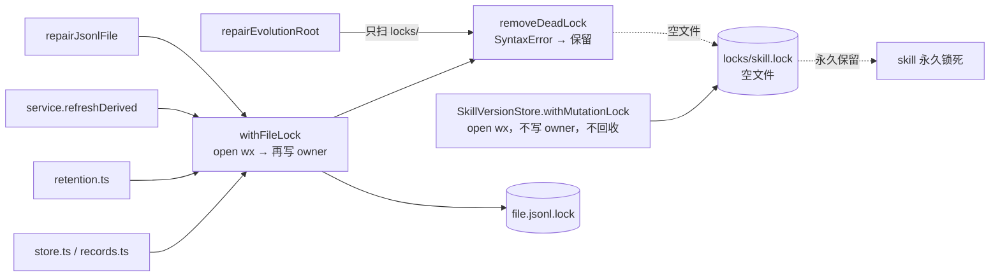
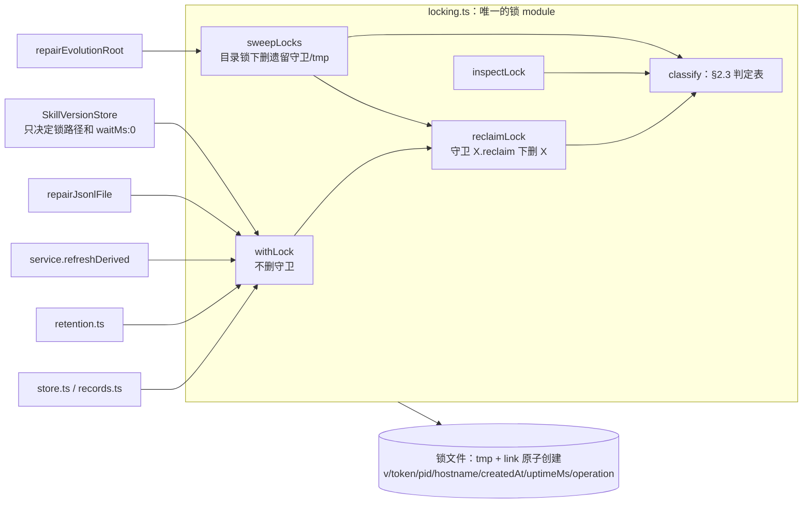

# 统一锁协议：锁文件写 owner，repair 回收崩溃遗留锁

- Issue：SKIL-41（父 SKIL-35，来源 SKIL-34 扫描第 1 条）
- 基线：`origin/main` @ `c168579`
- 范围：`packages/skill-evolution`。不改 `dsh-adapter`、`dsh-bundle`。

## 1. 现状

### 1.1 读了什么

- `packages/skill-evolution/src/locking.ts`（全文）：`withFileLock`、`removeDeadLock`、`hasCode`
- `packages/skill-evolution/src/lifecycle.ts`（全文）：`SkillVersionStore.withMutationLock`（`:215-235`）、`recoverPublication`、`.publish.json` 日志
- `packages/skill-evolution/src/repair.ts`（全文）：`repairJsonlFile`、`repairEvolutionRoot`、`removeOrphanLocks`（`:109-121`）
- 调用方：`src/store.ts:26,45`、`src/records.ts:14,31,44`、`src/retention.ts:13`、`src/service.ts:138-152,413-437`
- `src/index.ts`（`locking.ts` 不在公开导出里）、`package.json`（`exports` 含 `./src/*`，`engines.node >=22`）
- 测试：`tests/core.spec.ts:131-138`（死 owner 的 JSONL 锁）、`tests/evolution.spec.ts:209-219`（发布锁写字面量 `'held'`）
- `packages/skill-evolution/README.md:58-60,73-76`（锁的对外承诺：仅本机本地文件系统，repair 只删本机死 owner 的锁）
- `AGENTS.md`（红线：core 包不依赖 DSH 内部）、SKIL-34 报告附件第 1 条
- 第 2 轮补读：
  - `src/maintenance.ts`：worker 只调 `refreshDerived`，不调 repair。
  - `dsh-bundle/index.js:123,187`：observation store 默认是 `~/.dsh/skill-evolution/events.jsonl`，被所有项目 root 共享。
  - `lifecycle.ts:121-141`：发布步骤的顺序，`current.json` 在 `invalidate` 之前写入。
  - libuv `uv_uptime` 在 Linux、Darwin、FreeBSD、Windows 上的实现，以及本机 `os.uptime()` 的返回值（整数秒）。

### 1.2 两套锁

| | `withFileLock`（`locking.ts:7`） | `withMutationLock`（`lifecycle.ts:215`） |
|---|---|---|
| 锁文件 | `<资源文件>.lock`，与资源同目录 | `.skill-evolution/locks/<skill>.lock` |
| 用在 | 9 个 JSONL store、`rotateJsonl`、`repairJsonlFile`、`refreshDerived`（cursor） | `readCurrent`、`promote`、`rollback` |
| 写 owner | 先 `open('wx')`，再 `writeFile({pid,hostname,createdAt})`，两步之间有窗口 | 不写，锁文件永远是空的 |
| 争用 | 轮询 20ms，最多等 5s；等待时顺手 `removeDeadLock` | 立即失败 `already in progress` |
| 进程内串行 | 各 store 自带 `writeQueue`（读路径不排队） | 自带 `mutationQueue` |
| 崩溃恢复 | 死 pid 能回收；空文件/损坏文件 `SyntaxError` → 永不回收 | 从不回收；只有 repair 扫 `locks/`，但同样卡在 `SyntaxError` |

`repairEvolutionRoot` 只扫 `locks/` 目录，不看任何 `*.jsonl.lock` 和 `projection-cursor.json.lock`。

### 1.3 复现（`c168579`，build 之后用一次性脚本跑，脚本已删除）

```text
A empty publish lock -> removed 0 preserved 1
A promote after repair -> Skill publication already in progress for "api-debugging"
B promote with dead-owner lock, no repair -> Skill publication already in progress for "api-debugging"
C repairJsonlFile with empty lock -> store busy: /tmp/.../events.jsonl.lock (5011ms)
C locks/ dir entries 0
```

- A：promote 中途崩溃留下空发布锁，repair 之后仍然锁死。这就是 issue 里说的永久锁。
- B：即使锁里写着死 owner，发布路径自己也不会回收，只能靠 repair。
- C：`withFileLock` 死在 `open` 和 `writeFile` 之间留下的空锁，`repairJsonlFile` 自己就会卡 5 秒后失败；`repairEvolutionRoot` 根本扫不到它。

另有三个读代码发现、没有单独复现的问题：

- **回收竞态**：`removeDeadLock` 先读、判死、再 `unlink`。两个进程同时判死时，后 `unlink` 的那个可能删掉先回收者刚建好的新锁。
- **释放不校验身份**：`finally { unlink(path) }` 不确认锁还是自己的。锁若已被别人回收重建，释放会删掉别人的锁。
- **重启后 pid 复用**：机器崩溃重启后，锁里的旧 pid 可能被系统新进程占用，`kill(pid,0)` 判活，锁永不回收。

## 2. 设计问题与选项

### 2.1 锁 module 的 interface 形状

**选项 A：作用域式，三个函数（推荐）**

```ts
withLock<T>(path, operation, fn, options?): Promise<T>   // 获取 + 释放
inspectLock(path, options?): Promise<LockState>         // 查询
reclaimLock(path, options?): Promise<ReclaimResult>     // 按统一规则回收
```

**选项 B：句柄式**

```ts
acquireLock(path, operation, options?): Promise<LockHandle>  // handle.release()
inspectLock / reclaimLock 同 A
```

**选项 C：绑定根目录的 `LockManager` 类，按 key 加锁**，所有锁文件集中到 `.skill-evolution/locks/<key>.lock`。

| | A 作用域 | B 句柄 | C LockManager |
|---|---|---|---|
| 复杂度 | 最低；释放不可能被忘 | 调用方要自己 `try/finally` | 多一层对象和 key 命名规则 |
| 可测性 | 好；崩溃场景靠直接写锁文件 + 注入环境来造 | 同 A，还能测“持锁中途”的状态 | 同 A |
| 可逆性 | 以后要句柄式，可以在内部加 `acquireLock` 再让 `withLock` 包它 | 回退到 A 要改所有调用点 | 锁文件位置变了，回退要再搬一次 |
| 迁移成本 | 现有调用方都是作用域式（`withFileLock(path, fn)`），机械替换 | 每个调用点改写成 `try/finally` | 改路径；新旧版本进程共存时两边锁不同的文件，互斥失效；还会抢先定下 SKIL-38 的目录布局 |

推荐 **A**。`withFileLock` 的 8 个调用点和 `withMutationLock` 的 3 个入口全是作用域用法，没有需要跨函数持锁的场景；B 的额外能力今天没人用。C 的集中目录与 SKIL-38（演化状态根目录）重叠，本设计**不改任何锁文件的位置**，只统一协议。

### 2.2 锁文件格式与写入原子性

格式在各选项里相同，是现有 `{pid, hostname, createdAt}` 的超集。旧版本的 `removeDeadLock` 读新文件仍然能拿到 `pid` 和 `hostname`：

```json
{"v":1,"token":"<randomUUID>","pid":4242,"hostname":"build-7","createdAt":"2026-09-26T13:00:00.000Z","uptimeMs":1999854000,"operation":"promote"}
```

- `v`：格式版本。没有 `v` 但有 `pid`/`hostname` 的旧文件按 v0 解析，规则相同，只是没有 `token` 和 `uptimeMs`。
- `token`：`crypto.randomUUID()`。释放时核对，防止删掉别人的锁。
- `uptimeMs`：`Math.round(os.uptime() * 1000)`，本机自启动以来的毫秒数（`os.uptime()` 在各平台都是自启动单调递增、与墙上时钟无关，见 §2.3）。用来识别「机器重启后 pid 被复用」，不依赖 `createdAt` 与墙上时钟。
- `createdAt`：ISO 字符串，仅用于诊断、报告里的持有时长，以及 v0 锁的 `rebooted` 回退判定（§2.3）。不参与 v1 的 `rebooted` 判定。
- `operation`：调用方传入的短字符串（`append`、`read`、`replace`、`repair`、`rotate`、`refresh`、`promote`、`rollback`、`read-current`），只用于诊断和 repair 报告，不参与判定。

**写入选项 A：临时文件 + `link()`（推荐）**。先把 owner 写进同目录的 `<lock>.<token>.tmp`，再 `link(tmp, lockPath)`；目标已存在时 `link` 以 `EEXIST` 失败，所以锁一出现就带着完整内容。最后 `unlink(tmp)`。

**写入选项 B：保留 `open('wx')` 再写**，把“空文件”当成“正在写入”，给一个宽限期。

**写入选项 C：`mkdir(lockDir)` + 目录里放 `owner.json`**。目录创建是原子的，但 owner 仍是第二步写，窗口和 B 一样。

| | A link | B open+write | C mkdir |
|---|---|---|---|
| 复杂度 | 多一个临时文件和一次清理 | 最低 | 要处理目录和文件两种残留 |
| 可测性 | “锁存在但无 owner”只可能来自旧版本或掉电，测试直接写空文件就能覆盖 | 必须测时间窗口 | 同 B |
| 可逆性 | 锁路径和内容不变，随时可以换回 B | — | 锁从文件变成目录，旧版本进程 `open('wx')` 会拿到 `EISDIR`，不可平滑回退 |
| 迁移成本 | 与旧版本同路径互斥（`link` 和 `open('wx')` 都靠 `EEXIST`） | 同 A | 与旧版本不兼容 |

推荐 **A**。不做 `fsync`：掉电后 lock 可能是零长度，这由 §2.3 的 `unknown` 规则兜底。`link` 在不支持硬链接的文件系统上会报错，这时直接抛出，不静默退回 B；README 已声明只支持本机本地文件系统。

**临时文件的规则**。`<lock>.<token>.tmp` 和锁本身写的是同一份 owner，所以按 §2.3 的同一张判定表处理，不另设规则：

- 谁能删 tmp：它的 owner（`link` 之后立即 `unlink`，或 `link` 失败后 `unlink`），以及 repair（仅当判定为可回收时）。`withLock` 争用时**不碰**别人的 tmp，因为 tmp 不参与互斥，放着不影响获取。
- repair 判定 tmp 为 `held`（owner 活着，正在 `writeFile` 与 `link` 之间）时保留；`dead`/`rebooted` 时删除；`unknown`（写到一半掉电）按宽限期。
- owner 这边的防御：若 `link` 返回 `ENOENT`（自己的 tmp 被误删，例如人工清理），重新写 tmp 再 `link`，计入同一个 `waitMs` 预算，不算错误。`EEXIST` 走正常争用路径。
- 因为 tmp 名里含 token，两个进程永远不会写同一个 tmp；repair 删 tmp 和 owner 删 tmp 的竞争最多让一次 `unlink` 得到 `ENOENT`，按成功处理。

### 2.3 「崩溃遗留锁」判定规则

一个锁文件只会被归为下面一种状态。判定只看锁文件内容、`os.uptime()`、文件 mtime 和本机当前状态，除 `unknownGraceMs` 外不依赖任何配置。**v1 锁的判定不依赖墙上时钟**；v0 锁和 `unknown` 锁仍有墙上时钟依赖，下文写明了局限。

| 状态 | 条件（按顺序匹配） | 回收？ |
|---|---|---|
| `free` | 文件不存在 | — |
| `unknown` | 空文件、JSON 解析失败、缺 `pid`/`hostname`/`createdAt`，或 `pid` 不是正整数 | 文件 mtime 距今超过 `unknownGraceMs` 时回收，否则保留 |
| `foreign` | `hostname` 不等于本机 | 保留，报告 |
| `rebooted` | 本机。v1 锁：本机当前 `os.uptime()*1000` **小于**锁里的 `uptimeMs` 减 5s 容差（uptime 掉头 = 机器在锁创建后重启过）。v0 锁（无 `uptimeMs`）：回退用 `createdAt` 早于本机本次启动时刻（`Date.now() - os.uptime()*1000`）减 60s 容差 | 回收：owner 属于上一次启动，不可能还活着 |
| `dead` | 本机，`process.kill(pid, 0)` 抛 `ESRCH` | 回收 |
| `held` | 本机，`kill(pid,0)` 成功或抛 `EPERM`（进程存在但属于别的用户） | 保留，不论持有多久 |

几点说明：

- **为什么 v1 用 `uptimeMs` 而不是 `createdAt`**：`os.uptime()` 在所有目标平台都是自启动单调递增、与墙上时钟无关的量（Linux `CLOCK_BOOTTIME`、Windows `GetTickCount64`、FreeBSD `CLOCK_MONOTONIC`、Darwin `time() - KERN_BOOTTIME`）。重启后它归零，于是「当前 uptime < 锁记录的 uptime」是重启的确证。原设计用 `createdAt < Date.now()-os.uptime()*1000` 推算的「本次启动时刻」会随墙上时钟跳变而漂移：把系统时钟往前调，推算出的启动时刻越过一个活锁的 `createdAt`，活锁会被误判为 `rebooted` 而回收。改用 `uptimeMs` 直接比 uptime，绕开墙上时钟，这个误判消失。5s 容差吸收 `os.uptime()` 的整秒分辨率与 Darwin 上时钟微调带来的抖动，而真实重启会让 uptime 从数小时/数天掉到几秒，远超容差。
- **v0 锁的局限（已记录）**：v0 锁没有 `uptimeMs`，只能回退到 `createdAt` 推算，仍受墙上时钟前跳影响——极端情况下一个活着的 v0 owner 的锁可能被误判 `rebooted`。触发条件是：一个活着的旧版进程持锁期间，本机墙上时钟被往前调超过「本次已启动时长 − 该锁已持有时长 + 60s」。这是可接受的过渡期限制：v0 锁只出现在混用版本部署期间（旧版 JSONL 锁；旧版发布锁是空文件，走 `unknown`），全部进程升级到 v1 后消失。列入 §5 的 R-v0。
- **`uptimeMs` 规则的反方向局限（保守，不误删）**：只有在新一次启动的 uptime 还没超过锁里的 `uptimeMs` 时，`rebooted` 才能识别。例如锁在开机 10 分钟时创建、机器崩溃重启，重启后过了 2 小时才第一次检查这把锁，此时 uptime 已经大于 `uptimeMs`，判定落到 `kill(pid,0)`：pid 未被复用则 `dead`，照常回收；pid 恰好被新进程复用则 `held`，锁被保留。这个方向只会让遗留锁「多留」，不会误删活锁，repair 报告会以 `held` 和很长的 `ageMs` 显示出来，需要人工删除。同一次启动内的 pid 回绕复用也是同样的保守结果，这是今天就有的行为。要彻底消除需要按平台读 boot id（Linux `/proc/sys/kernel/random/boot_id`、Darwin `kern.bootsessionuuid`），Windows 没有等价物，本次不做，列入 §5 的 R-boot。
- `unknown` 的宽限期是为了保护**混用版本**时旧进程的空锁（旧 `open('wx')` 写 owner 前的窗口，以及旧版发布锁整个持有期都是空文件）。新版本自己只可能因为掉电留下空锁。
- 「超时」只作用于 `unknown`。能证明 owner 还活着的 `held` 锁，持有再久也不回收，repair 只在报告里标出持有时长。这是对 issue 原文「超时能回收」的收窄，理由是它和「活着的 owner 不被误回收」冲突；见 §5 待定项 D3。
- `EPERM` 今天被当成“无法判断、保留”，新规则把它明确归为 `held`，行为不变。

**谁来回收**：同一条规则有两个入口，结果一致。

1. `withLock` 争用时：`EEXIST` → `inspectLock` → 可回收则 `reclaimLock` 后立刻重试，否则等到 `waitMs` 截止。发布锁因此也能自愈（修掉 §1.3 的 B）。
2. `repair`：通过 `sweepLocks` 对所有已知锁调用 `reclaimLock`，并写进报告（修掉 A 和 C）。它还额外清理遗留守卫和 tmp（见下文和 §3.3）。

**回收本身的并发安全**（修掉回收竞态）：

- **选项 A：回收守卫 + 遗留守卫只由 repair 在目录锁下清理（推荐）**。见下文。
- **选项 B：rename 到墓碑再比对**。`rename(X, X.reclaimed-<token>)` 后读墓碑，内容与判定时不一致就说明抢到了活锁，再 `link` 回去。恢复这一步本身会竞争失败，失败时活 owner 的锁文件就丢了。
- **选项 C：不处理**，接受极小概率的误删。

推荐 **A**。协议分三层，每层只有一种角色能删对应的文件：

1. **锁 `X`**：回收 `X` 前先用同一套 link 协议拿守卫 `G = X.reclaim`（`waitMs` 0）。拿到后重新读 `X`、重新判定、可回收才 `unlink(X)`，最后按 token 释放 `G`。
2. **守卫 `G`**：`withLock`（以及 `reclaimLock`）遇到已存在的 `G` 时**一律不删**：
   - `G` 为 `held`：别人正在回收，回去继续轮询 `X`。
   - `G` 可回收（遗留守卫）：把 `X` 当作忙，继续轮询到 `waitMs` 截止，抛出的 `LockBusyError` 带 `guard` 字段，消息点名守卫文件并提示运行 repair。
   遗留守卫只由 repair 清理，而且只在持有**目录锁** `D = <dirname(X)>/.lock-sweep.lock` 时清理：读 `G`、判定可回收、`unlink(G)`。
3. **目录锁 `D`**：就是一把普通锁，走 `withLock(D, 'sweep', …, { waitMs: 0 })`。拿不到说明另一个 repair 正在清理这个目录，本次跳过该目录的守卫与 tmp 清理，在报告里标 `skipped`。`D` 的遗留按第 1 层回收（守卫是 `D.reclaim`）；`D.reclaim` 的遗留**不自动清理**，repair 报告与错误消息点名它，需要人工删除（见 §5 R-guard）。

目录锁放在锁所在目录而不是按 root 放：observation store 默认是 `~/.dsh/skill-evolution/events.jsonl`（`dsh-bundle/index.js:187`），被所有项目 root 共享。两个不同 root 的 repair 会清理同一个 `events.jsonl.lock.reclaim`，按 root 加锁串行化不了它们，按目录加锁可以。

**正确性论证**。需要证明的是：任何一次「读 → 判定 → `unlink`」之间，路径上的文件不会被换成另一个。路径上的文件要被换掉，必须先被别人删掉。所以对每种文件，只需列出所有可能删它的角色。

- **`X`**：能删它的只有 (i) 它的 owner，释放时校验 token，(ii) 持有 `G` 的回收者。回收者删 `X` 时，`X` 已判为可回收。对 v1 锁，这意味着 owner 已死或属于上次启动，(i) 不会发生；持有 `G` 的回收者同一时刻只有一个，(ii) 也只有它自己。所以它读到的 `X` 就是它删的 `X`。
- **`G`**：能删它的只有 (i) 它的 owner，释放时校验 token，(ii) 持有 `D` 的 repair，且只删已判为可回收的 `G`。`withLock`/`reclaimLock` 从不删 `G`。
  - repair 删一个遗留 `G` 时，`G` 的 owner 已死，不会删；持有 `D` 的 repair 同一时刻只有一个。所以没有别人能先删掉这个 `G` 再建一个新的，被删的就是判定过的那个。
  - `G` 的 owner 释放时，owner 还活着，`G` 不可回收，repair 不会删它；也没有别人能删它。所以校验 token 与 `unlink` 之间 `G` 不会被换掉。
- **`D`**：同 `X` 的论证，只是守卫换成了 `D.reclaim`。`D.reclaim` 没有自动删除者，只有它的 owner 和人工。

Reviewer 指出的竞态是：R1、R2 都判定一个遗留守卫已死，R1 删掉它、建了 G1，R2 删掉 G1、建了 G2，两者都进入对 `X` 的回收，最后误删 P3 的活锁。在新协议里它不可能发生，因为 R1、R2 若是 `withLock` 就根本不删守卫，若是 repair 就被 `D` 串行化。原文「结果仍然正确」的论证已删除。

**代价与可逆性**。遗留守卫需要两次故障才会出现：先有一把遗留锁，回收者又恰好在拿到守卫和释放守卫之间的几次系统调用里崩溃。出现后，对应资源在跑 repair 之前一直是忙的，`LockBusyError` 会告诉用户该怎么做。以后如果要让它自愈，可以让 `withLock` 也在 `D` 下清理守卫，论证不变，只多一条调用路径，所以这个选择是可逆的。

**混用版本**。旧版 `removeDeadLock` 不走守卫，会直接 `unlink` 已死 owner 的 `X`，所以部署期间这个竞态对旧版进程仍然存在：旧版删掉死锁，新进程建了新锁，持有 `G` 的新版回收者再删掉这把新锁。触发条件是新旧两边同时回收同一把死锁。全部进程升级后消失。列入 §5 R-mixed。

**释放**：读锁文件，`token` 与自己的一致才 `unlink`；不一致或文件已不存在就只记一次警告，不抛错（修掉“释放不校验身份”）。

### 2.4 进程内串行放在哪

各 store 的 `writeQueue` 和 `SkillVersionStore.mutationQueue` 保证同一实例内的顺序。可以把它们收进锁 module（按路径的进程内队列），也可以留在调用方。

推荐**留在调用方，本次不动**。收进来会改变语义：同进程里两个 `SkillVersionStore` 实例现在是互相 fail-fast，收进来后会变成排队；`readAll` 现在不排队，收进来后会排队。这些行为变化和本 issue 无关，可以以后单独做。

### 2.5 unknown 锁的判定：只用 mtime 宽限期

`unknown` 锁（空文件、损坏、缺字段）没有可信的 `uptimeMs`，也没有 `createdAt`，只能看文件 mtime。原设计想「mtime 早于本机本次启动时刻就按 `rebooted` 立即回收」，但「本次启动时刻」= `Date.now() - os.uptime()*1000` 同样是墙上时钟推算，和 §2.3 修掉的 `rebooted` 是同一个墙上时钟漏洞：时钟前跳会把一个刚创建的空锁误判为「早于启动」而回收。而空锁恰恰最需要宽限期保护——它可能是旧版进程正在 `open('wx')` 和写 owner 之间的窗口。

所以 `unknown` 锁**只用一条规则**：mtime 距今超过 `unknownGraceMs`（默认 10 分钟，见 D1）才回收，否则保留。不再引入任何基于启动时刻的比较。代价是新版本自己因掉电留下的零长度锁（不做 `fsync` 时，`link` 已落盘而内容未落盘）重启后也要等满宽限期才回收；这需要掉电，本就少见。

剩余的墙上时钟依赖：「mtime 距今」本身是 `Date.now() - mtime`，时钟前跳超过 `unknownGraceMs` 会让一个宽限期内的空锁提前变为可回收。空锁没有 owner，无法用 `uptimeMs` 或 pid 判活，这个依赖消除不了，只能靠宽限期取得足够长（10 分钟）来降低概率；而新版本在正常运行中不产生空锁，受影响的只有混用版本期间旧版进程的锁。列入 §5 R-v0。

## 3. 推荐方案

### 3.1 Interface

`src/locking.ts` 整体替换为下面这个 module。

```ts
export type LockState =
  | { readonly kind: 'free' }
  | { readonly kind: 'held'; readonly owner: LockOwner; readonly ageMs: number }
  | { readonly kind: 'foreign'; readonly owner: LockOwner; readonly ageMs: number }
  | { readonly kind: 'dead' | 'rebooted'; readonly owner: LockOwner; readonly ageMs: number }
  | { readonly kind: 'unknown'; readonly ageMs: number; readonly reclaimable: boolean }

export interface LockOwner {
  readonly v?: 1
  readonly token?: string           // v1 必有
  readonly pid: number
  readonly hostname: string
  readonly createdAt: string
  readonly uptimeMs?: number        // v1 必有；v0 缺省时 rebooted 回退到 createdAt 规则
  readonly operation?: string
}

export interface LockOptions {
  readonly waitMs?: number          // 默认 5000；0 表示只试一次（含一次回收）
  readonly unknownGraceMs?: number  // 默认 600_000
}

export class LockBusyError extends Error {
  readonly path: string
  readonly state: LockState         // 截止时最后一次 inspect 的结果
  readonly guard?: string           // 被遗留回收守卫挡住时，守卫文件路径；消息提示运行 repair
}

export interface SweptLock {
  readonly path: string             // 锁、守卫或 tmp 的路径
  readonly artifact: 'lock' | 'guard' | 'tmp'
  readonly state: LockState['kind'] | 'skipped'   // skipped：目录锁被另一个 repair 持有
  readonly operation?: string
  readonly ageMs?: number
  readonly removed: boolean
}

/** 获取 → 执行 → 释放。争用时按 §2.3 自动回收可回收的锁；从不删除回收守卫。 */
export function withLock<T>(path: string, operation: string, fn: () => Promise<T>, options?: LockOptions): Promise<T>

/** 只读判定，不改任何文件。 */
export function inspectLock(path: string, options?: Pick<LockOptions, 'unknownGraceMs'>): Promise<LockState>

/** 可回收则在回收守卫下删除；返回删除前的判定和是否删除。遇到遗留守卫时 removed:false 并返回 guard。 */
export function reclaimLock(path: string, options?: Pick<LockOptions, 'unknownGraceMs'>): Promise<{ readonly state: LockState; readonly removed: boolean; readonly guard?: string }>

/**
 * repair 专用。按目录分组，每个目录在目录锁 `.lock-sweep.lock` 下依次：
 * 清理可回收的遗留守卫 → 对每把锁 reclaimLock → 清理可回收的 tmp。
 * `directories` 整目录扫描所有协议文件；`paths` 只处理列出的锁及其守卫、tmp（用于共享目录）。
 */
export function sweepLocks(target: { readonly directories: readonly string[]; readonly paths: readonly string[] }, options?: Pick<LockOptions, 'unknownGraceMs'>): Promise<readonly SweptLock[]>

export function hasCode(error: unknown, code: string): boolean   // 保留，repair/lifecycle 复用
```

interface 里调用方要知道的事实：

- 锁只在同一主机、本地文件系统上有效；`link` 不可用时抛原始错误。
- `withLock` 不可重入：同一进程对同一路径嵌套调用会等到超时。进程内顺序由调用方自己的队列保证（§2.4）。
- 回收规则只有 §2.3 这一张表；`withLock`、`reclaimLock` 和 `sweepLocks` 走的是同一份 `classify`。
- 守卫、tmp、目录锁的文件命名只在 `locking.ts` 内部出现；repair 不认识 `.reclaim`、`.tmp` 这些后缀，只调用 `sweepLocks`。
- `LockBusyError.state` 让调用方决定错误文案，例如 `SkillVersionStore` 仍然抛 `Skill publication already in progress for "<skill>"`，并在消息后附上 owner 的 pid 和 operation；`guard` 存在时改为提示运行 repair。

`withFileLock` 和 `removeDeadLock` 删除。它们没从 `src/index.ts` 导出，仓库里也没有包外调用方（`grep -rn "locking" packages --include=*.ts --include=*.js --include=*.mjs` 只命中 `skill-evolution/src` 内部），但 `package.json` 的 `exports` 暴露了 `./src/*`，严格说是可见的，见 §5 D2。

§2.1 的三个函数之外多了 `sweepLocks`：它是 repair 唯一需要的入口。把「守卫只在目录锁下删」这条规则放在锁 module 里，而不是让 repair 自己拼 `.reclaim` 路径，这样 §2.3 的正确性论证只依赖 `locking.ts` 一个文件（locality）。

内部实现拆成几个私有函数（`writeOwner`、`classify`、`underReclaimGuard`、`release`、`sweepDirectory`），都是 module 内部的 seam，不导出。测试不需要注入时钟或进程探测：所有状态都能靠真实文件和真实 pid 构造（见 §6）。

### 3.2 发布锁的语义

`withMutationLock` 改为调用 `withLock(lockPath, operation, fn, { waitMs: 0 })`：

- 锁文件位置不变：`.skill-evolution/locks/<skill>.lock`。
- 仍是 fail-fast，但失败前会按规则回收一次。死 owner、上次启动的 owner、宽限期外的空锁都会被自动回收，不用再跑 repair。唯一的例外是遗留回收守卫（§2.3 第 2 层），这时错误消息提示运行 repair。
- `operation` 分别是 `read-current`、`promote`、`rollback`。
- 回收发布锁后，下一次 `readCurrentUnlocked` 里现有的 `recoverPublication`（`lifecycle.ts:298-312`）按 `.publish.json` 处理中断的发布，这条路径不用改。它的效果取决于崩溃点：
  - 版本目录已完整写入：补写 `SKILL.md`、`manifest.json`、`current.json`，调用 `invalidate`，删除 `.publish.json`。
  - 已写到 `current.json`（`lifecycle.ts:139`）、死在 `invalidate`（`:140`）或之后：同上，结果幂等。
  - 版本目录不完整（死在 `:122` 到 `:136` 之间）：`readVersionIfPresent` 返回 `undefined` 或抛错，`recoverPublication` 直接返回，`.publish.json` 留着，`health` 继续报告它。这是今天就有的行为，不在本设计范围内。

### 3.3 repair 覆盖的锁

`repairEvolutionRoot` 的 `removeOrphanLocks` 换成一次 `sweepLocks` 调用，覆盖三类位置：

1. `directories`：`.skill-evolution/locks/`（发布锁）和 `.skill-evolution/`（状态目录下 9 个 JSONL 和 cursor 的锁）。这两个目录只属于本 root，整目录扫描。
2. `paths`：`options.observationsPath` 与 `options.jsonlPaths` 各自的 `<path>.lock`，只处理列出的这几把锁。observation store 可以在状态目录之外，例如 bundle 默认的 `~/.dsh/skill-evolution/events.jsonl` 被所有项目共享，不能整目录扫描别人的文件。

每个目录（包括 `paths` 所在的目录）都在该目录的目录锁下处理，顺序固定为：

1. 遗留守卫 `*.lock.reclaim`：判定可回收就删除（§2.3 第 2 层），`held` 保留。
2. 锁 `*.lock`：`reclaimLock`。
3. tmp `*.lock.*.tmp`：按 §2.2 的 tmp 规则判定，`held` 保留，可回收的删除。

目录锁拿不到时，该目录的条目在报告里记为 `skipped`，repair 不失败。目录锁 `.lock-sweep.lock` 本身和它的守卫、tmp 不参与扫描，也不进报告；它们遗留时走 §2.3 第 3 层的规则。

`EvolutionRepairReport` 只做加法。`orphanLocksRemoved`、`locksPreserved` 保持原样，只统计 `artifact: 'lock'` 的条目：

```ts
readonly locks: readonly SweptLock[]
```

`service.repair()` 里 `repairJsonlFile` 在前、`repairEvolutionRoot` 在后，顺序不变。`repairJsonlFile` 通过 `withLock` 自己就能回收它要用的那一把锁，所以 §1.3 的 C 不再卡 5 秒。

### 3.4 Before / After 模块关系

Before：



After：



**locality**：判定表只有一份，`withLock` 自愈和 repair 回收走同一个 `classify`；守卫、tmp、目录锁的删除规则也只在 `locking.ts` 里，§2.3 的正确性论证不需要读任何调用方。**leverage**：全部 11 个加锁入口只学一个函数，就同时得到 owner 记录、原子写、自动回收和释放校验。**删除测试**：删掉这个 module，owner 写入、判活、回收会重新散回至少 3 个文件，这正是今天的状态。

### 3.5 这条 seam 将来会被什么拉扯

- **锁文件位置**：SKIL-38 会重新定目录布局。锁路径由调用方传入，布局变化只改调用方，不碰锁 module。
- **跨主机/网络文件系统**：若要支持，得换一种判活方式（租约 + 心跳）。那时才会有第二个 adapter；今天只有一个，**不引入可替换的判活 seam**，`classify` 保持为内部函数。
- **更多加锁操作**（worker 与 CLI 并发 promote、按 scope 加锁）：只需传一个新的 `operation` 字符串，不用选协议。
- **诊断需求**（`health` 里展示锁状态）：`inspectLock` 已经是只读查询，`healthIssues` 以后直接调用即可，本次不接。

## 4. 迁移

每一步都能单独合并、单独测试，Spec Writer 可以按下面的顺序直接拆成 `tasks.md`：

1. **新 module**：在 `locking.ts` 实现 `withLock`、`inspectLock`、`reclaimLock`、`sweepLocks`、`LockBusyError`，先保留 `withFileLock`（内部改为调用 `withLock(path, 'legacy', fn, { waitMs })`）和 `removeDeadLock`（改为调用 `reclaimLock` 并返回 `removed`）。新增 `tests/locking.spec.ts`，覆盖 §6 的 L1–L15。
2. **JSONL 调用方切换**：`store.ts:26,45`、`records.ts:14,31,44` 改为 `withLock(path, 'append'|'read'|'replace', …)`；`retention.ts:13` 用 `'rotate'`；`repair.ts:28` 用 `'repair'`；`service.ts:414` 用 `'refresh'`。只是传参变化，已有测试应原样通过。
3. **发布锁切换**：`lifecycle.ts:215-235` 改为 `withLock(lockPath, operation, fn, { waitMs: 0 })`，捕获 `LockBusyError` 后抛原来的 `already in progress` 文案（附 owner 信息）。删掉 `isExists`。更新 `tests/evolution.spec.ts:209-219`：`'held'` 这个字面量现在是宽限期内的 `unknown`，行为仍是拒绝，测试可以保留，另加 P1–P3。
4. **repair 覆盖面**：`repair.ts:109-121` 的 `removeOrphanLocks` 换成一次 `sweepLocks` 调用（§3.3 的目录与路径），`EvolutionRepairReport` 加 `locks`。新增 R1–R5。
5. **收尾**：删除 `withFileLock`、`removeDeadLock`；更新 `README.md:58-60,73-76` 的锁说明（回收规则表、宽限期、`foreign` 不回收）。

混用版本（部署期间新旧进程同时存在）时的行为：

- 两边对同一路径互斥：新版 `link` 和旧版 `open('wx')` 都靠 `EEXIST`。
- 新版回收旧版的空锁只在宽限期之后，所以不会抢走一个正在写 owner 的旧进程的锁；旧版发布锁（整个持有期都是空文件）持有超过 10 分钟会被新版视为可回收，这是已知限制，见 D1。
- 旧版读到新格式的锁文件，`pid`、`hostname` 字段都在，旧逻辑照常工作。
- 旧版 `removeDeadLock` 不认识回收守卫，与新版同时回收同一把死锁时仍有 §2.3 描述的竞态（R-mixed）。
- 旧版 repair 只扫 `locks/`，会把里面的 `.reclaim`、`.tmp`、`.lock-sweep.lock` 当成普通锁：owner 已死就删，活的或解析失败就保留。它不会删掉活 owner 的文件。但它删死守卫时不持有目录锁，所以在 `locks/` 里，它是新版 repair 之外的第二个守卫删除者，§2.3 的 `G` 论证在混用期间不成立。触发条件：`locks/` 里有遗留守卫，新旧两个 repair 同时运行，中间还有新版 `withLock` 建出新守卫。这个情况归入 R-mixed。

## 5. 不可逆决策与待定项

| # | 决策 | 类型 | 推荐（默认答案） | 状态 |
|---|---|---|---|---|
| F1 | 锁文件格式 v1：`{v,token,pid,hostname,createdAt,uptimeMs,operation}`，兼容读取 v0 | 数据格式 | 如 §2.2 | 本文确定；只做加法，与 v0 双向兼容，可逆性高 |
| F2 | 锁文件位置不变（`<file>.lock`、`locks/<skill>.lock`） | 数据格式 | 不变，布局留给 SKIL-38 | 本文确定 |
| F3 | 依赖方向：`lifecycle.ts → locking.ts` 新增一条边；`locking.ts` 只依赖 `node:*` | 依赖方向 | 如此 | 本文确定；不触碰「core 不依赖 DSH 内部」红线 |
| F4 | `EvolutionRepairReport` 新增 `locks` 字段 | 公开接口 | 只加不改 | 本文确定 |
| D1 | `unknownGraceMs` 默认值 | 行为 | **10 分钟**。旧版发布锁持有超过 10 分钟的情况视为不存在（promote 只做几次原子写） | **待成员确认** |
| D2 | 删除 `withFileLock` / `removeDeadLock`（未从 `index.ts` 导出，但经 `exports["./src/*"]` 可见） | 公开接口 | **删除**，包版本 `0.1.0`，仓库内无外部调用方 | **待成员确认** |
| D3 | 活着的 owner（`held`）不设超时，永不自动回收；issue 原文「超时能回收」只作用于无 owner 的 `unknown` 锁 | 行为（对 issue 的收窄） | **不设超时**。超时回收活锁会让两个进程同时写同一个 JSONL 或同时发布 | **待成员确认** |
| D4 | `foreign`（别的主机名）锁永不自动回收，只报告 | 行为 | **保留**，与 README 现有承诺一致 | 本文确定 |
| F5 | 新增协议文件名：`<lock>.<token>.tmp`、`<lock>.reclaim`、`<dir>/.lock-sweep.lock` | 数据格式 | 如 §2.2、§2.3 | 本文确定；名字只在 `locking.ts` 内部出现，可以改名 |

D1–D3 若成员选择与默认不同，只影响 §2.3 判定表的一行和对应测试，不影响 interface 形状，Spec 可以先按默认拆。

已知剩余风险（接受，不阻塞实现）：

| # | 风险 | 触发条件 | 后果 | 何时消失 |
|---|---|---|---|---|
| R-guard | 遗留回收守卫不自愈 | 回收者在拿到守卫与释放守卫之间崩溃（需要先有一把遗留锁） | 对应资源一直忙，直到跑 repair；`D.reclaim` 遗留则需要人工删除，repair 报告会点名 | 以后改为 `withLock` 在目录锁下清理守卫（§2.3 代价与可逆性） |
| R-v0 | v0 锁与空锁仍依赖墙上时钟 | 旧版进程持锁期间，墙上时钟前跳超过「已启动时长 − 已持有时长 + 60s」（v0）或超过 `unknownGraceMs`（空锁） | 活着的旧版进程的锁被误回收 | 全部进程升级到 v1 |
| R-mixed | 新旧版本并存时回收不串行 | 部署期间，旧版 `removeDeadLock` 与新版回收者同时处理同一把死锁；或旧版 repair 与新版 repair 同时处理 `locks/` 里的遗留守卫（§4） | 极小概率删掉第三个进程刚建的锁 | 全部进程升级到 v1 |
| R-boot | pid 复用识别不完整 | 机器崩溃重启，新启动的 uptime 超过锁里的 `uptimeMs` 之后才检查，且 pid 恰好被复用 | 遗留锁被当成 `held` 保留（多留，不误删），需要人工删除 | 以后按平台引入 boot id |

## 6. 测试策略

全部用真实文件和真实进程构造状态，不 mock `fs`，不注入时钟：

- 活 owner：当前进程 `process.pid`。
- 死 owner：`spawnSync(process.execPath, ['-e', ''])` 拿到的已退出子进程 pid，比写死 `999999` 可靠。
- 上次启动的 owner（v1）：`uptimeMs: os.uptime() * 1000 + 86_400_000`，锁记录的 uptime 比当前多一天，等价于「锁创建后机器重启过」。
- 上次启动的 owner（v0）：无 `uptimeMs`，`createdAt: new Date(0).toISOString()`。
- 墙上时钟跳变：v1 锁写 `createdAt: new Date(0).toISOString()`，同时写一个合法的 `uptimeMs`（`os.uptime() * 1000 - 1000`）。这等价于「锁创建之后墙上时钟被往前调了几十年」，不用真的去改系统时钟。
- 宽限期外的空锁：用 `utimes` 把 mtime 设到 1970。
- 外来主机：`hostname: 'another-host'`。
- 真崩溃：子进程里跑 `promote`，在 `invalidate` 回调里 `process.kill(process.pid, 'SIGKILL')`。此时 `current.json` 已写入（`lifecycle.ts:139` 在 `:140` 之前），`.publish.json` 和锁文件还在。

### 锁 module（`tests/locking.spec.ts`）

| # | 场景 | 期望 |
|---|---|---|
| L1 | 正常获取/释放 | 执行期间锁文件是完整的 v1 JSON，含 `token`、`uptimeMs`、`operation`；结束后锁文件和 `.tmp` 都不存在 |
| L2 | `fn` 抛错 | 锁被释放，错误原样抛出 |
| L3 | 死 owner | `withLock` 立即获取，`inspectLock` 为 `dead` |
| L4 | v1 锁，`uptimeMs` 比当前 `os.uptime()*1000` 大一天（pid 恰好是活进程，如 `process.pid`） | `rebooted`，可回收；`withLock` 立即获取 |
| L5 | 空文件 / 非 JSON / 缺字段，mtime 在宽限期内 | `unknown`、`reclaimable:false`，`withLock({waitMs:0})` 抛 `LockBusyError` |
| L6 | 同 L5，但 mtime 超过 `unknownGraceMs` | 回收后获取成功 |
| L7 | 活 owner | `held`，`waitMs` 截止抛 `LockBusyError`，`state.kind === 'held'`；锁文件未被改动 |
| L8 | 外来主机 | `foreign`，永不回收 |
| L9 | 释放时 token 不符（`fn` 内把锁文件改写成别的 token） | 释放不删文件 |
| L10 | 回收竞态：一把死锁，8 个子进程同时 `withLock` 并在临界区里对共享计数文件做读-改-写 | 最终计数为 8，任何时刻临界区内最多一个进程 |
| L11 | tmp 残留：死 owner 的 `X.<t1>.tmp`、活 owner（`process.pid`）的 `X.<t2>.tmp`、宽限期内的空 `X.<t3>.tmp` | 都不阻塞 `withLock(X)` 获取；`sweepLocks` 只删 `t1`，`t2`（`held`）与 `t3`（`unknown`）保留，报告里 `artifact:'tmp'` 状态正确 |
| L11b | tmp 被外部删掉：一个子进程循环 `withLock(X)` 200 次，另一个子进程持续删除目录里所有 `*.tmp` | 200 次全部成功（覆盖 `link` 返回 `ENOENT` 时重写 tmp 再重试），无 `ENOENT` 抛出，结束后没有残留 tmp |
| L12 | v0 旧格式 `{pid,hostname,createdAt}` 死 owner | 与 v1 同样判定（覆盖现有 `core.spec.ts:131-138`） |
| L13 | **墙上时钟跳变**：活 owner（`process.pid`），`createdAt` 设到 1970，`uptimeMs` 合法（当前 uptime 附近） | `held`，不回收；证明前跳的墙上时钟不会误判 v1 活锁为 `rebooted` |
| L14 | v0 锁，`createdAt` 设到 1970（早于本次启动），pid 是活进程 | `rebooted`，可回收（v0 回退规则，局限见 R-v0） |
| L15 | **遗留守卫**：一把死 owner 的锁 `X` + 一个死 owner 的 `X.reclaim` | `withLock(X,{waitMs:0})` 抛 `LockBusyError`，`error.guard` 指向 `X.reclaim`，`X` 未被删；随后 `sweepLocks` 删掉守卫，再 `withLock(X)` 成功 |

### 发布锁（`tests/evolution.spec.ts`）

| # | 场景 | 期望 |
|---|---|---|
| P1 | 真崩溃：子进程 promote 在 `invalidate` 里被 SIGKILL（`current.json` 已写入） | 父进程不跑 repair，直接 `readCurrent`，自动回收发布锁（`dead`）；`recoverPublication` 幂等补一次，`.publish.json` 被删除，`current.json` 仍指向新版本；父进程的 `invalidate` 被调用一次 |
| P1b | 手工构造「版本目录已写、`current.json` 未写」：`versions/<new>/` 完整，`.publish.json` 指向它，`current.json` 仍是旧版本，外加一把死 owner 的发布锁 | `readCurrent` 回收锁，`recoverPublication` 补完发布：`current.json`、`SKILL.md`、`manifest.json` 指向新版本，`.publish.json` 被删除 |
| P2 | 发布锁被活 owner 持有 | `promote` 抛 `already in progress`，消息里带 owner pid 和 operation |
| P3 | 同一 `SkillVersionStore` 实例并发 `promote` 与 `rollback` | 仍按 `mutationQueue` 串行，不互相 fail-fast（回归） |

### repair（`tests/core.spec.ts`）

| # | 场景 | 期望 |
|---|---|---|
| R1 | `locks/` 下空发布锁，mtime 超过 `unknownGraceMs` | `orphanLocksRemoved` 含它，之后 `promote` 成功（即 §1.3 的 A） |
| R2 | `.skill-evolution/*.jsonl.lock` 与状态目录外的 `observationsPath.lock` 为死 owner | 都被回收并出现在 `locks` 报告里（§1.3 的 C） |
| R3 | 活 owner、外来主机、宽限期内空锁 | 全部保留，`locksPreserved` 与 `locks[].state` 正确 |
| R4 | `service.repair()` 在一个空 `.jsonl.lock` 已过宽限期时 | 不再卡 5 秒，整体成功 |
| R5 | 两个不同 root 的 `repairEvolutionRoot` 共享同一个 `observationsPath`，其目录里有一个死 owner 的 `events.jsonl.lock.reclaim`；两个 repair 以子进程并发运行 | 守卫只被删除一次；一个 repair 报告 `removed`，另一个报告 `removed` 或 `skipped`；两个 repair 都不失败 |

### 验收时要跑的命令

```bash
npm --prefix packages/skill-evolution run build
npm --prefix packages/skill-evolution test
npm --prefix packages/dsh-adapter test
```

注意：`tests/core.spec.ts` 里跨进程去重的用例依赖 `lib/`，需要先 build，否则报 `ERR_MODULE_NOT_FOUND .../lib/index.js`。
